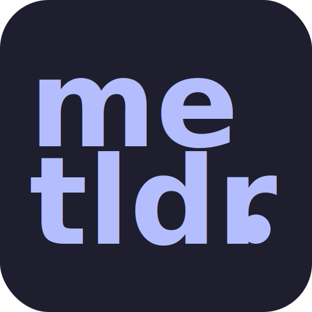

  

  
  

> **metldr** is a privacy first, local ai powered chrome extension designed to enhance productivity by integrating summarisation, smart replies, and dictionary lookups directly into your browser.

## install

- **chrome web store**: https://chromewebstore.google.com/detail/kbfdmfgmmibkdnbfdaeganjckfgbfjlh

## features

- **email intelligence**: automatically summarises threads, extracts key facts (dates, amounts), and generates context aware reply suggestions in gmail.
- **page intelligence**: detects article content, provides bulleted summaries, and allows you to chat with any webpage.
- **pdf intelligence**: full featured pdf reader with summarisation, q&a (rag), and local file support.
- **instant definitions**: three tier dictionary lookup (local > api > llm) for instant word definitions.
- **privacy first**: runs entirely on device using chrome built in ai (gemini nano) or local ollama models.

## usage

### setting up ai providers

#### option 1: chrome built in ai (recommended)

metldr uses chrome's built in gemini nano model by default.

1. ensure you are on chrome version 138+
2. enable "prompt api for gemini nano" in `chrome://flags`
3. the extension will automatically detect availability

#### option 2: ollama (for power users)

run larger models (llama 3, qwen, etc.) locally on your machine.

1. install [ollama](https://ollama.com)
2. run a model: `ollama run llama3.2`
3. go to metldr settings > ai provider > select "ollama"
4. ensure ollama is running at `http://127.0.0.1:11434`

## development

### commands

| command                   | description                                |
| :------------------------ | :----------------------------------------- |
| `npm run dev`             | start development server (hmr for ui)      |
| `npm run build`           | build all targets (main, content, sandbox) |
| `npm run type-check`      | run typescript validation                  |
| `npm run download:models` | download required ai models to public/     |

## privacy

metldr is designed with a strict privacy first architecture:

- **local execution**: all ai processing happens on your device (via chrome ai or localhost ollama).
- **no data collection**: we do not collect, store, or transmit your emails, browsing history, or personal data.
- **offline capable**: core features work without internet access.

---

_built with ❤️ by efaz_
